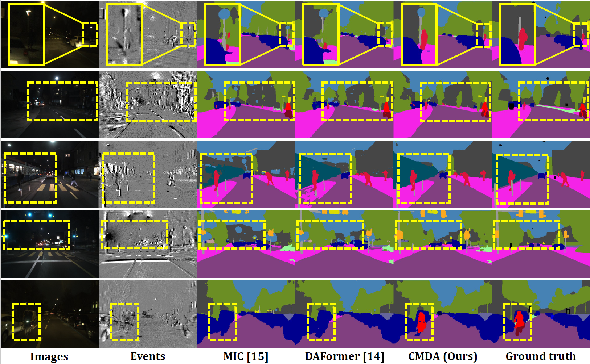
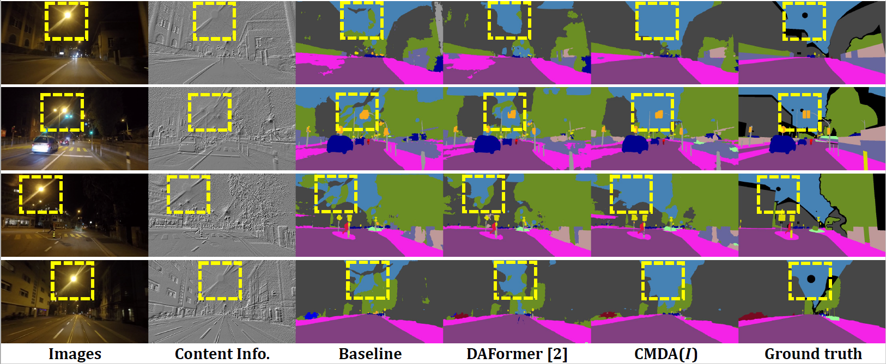

## CMDA: Cross-Modality Domain Adaptation for Nighttime Semantic Segmentation

**by Ruihao Xia, Chaoqiang Zhao, Meng Zheng, Ziyan Wu, Qiyu Sun, and Yang Tang**

**[[Arxiv]](https://arxiv.org/abs/2307.15942)**
**[[Paper]](https://arxiv.org/pdf/2307.15942.pdf)**

:bell: We are happy to announce that CMDA was accepted at **ICCV2023**. :bell:

## Overview

Most nighttime semantic segmentation studies are based on domain 
adaptation approaches and image input. However, limited by the 
low dynamic range of conventional cameras, images fail to capture 
structural details and boundary information in low-light conditions.

Event cameras, as a new form of vision sensors, are complementary 
to conventional cameras with their high dynamic range. To this end, 
we propose a novel unsupervised Cross-Modality Domain Adaptation 
(CMDA) framework to leverage multi-modality (Images and Events) 
information for nighttime semantic segmentation, with only labels on 
daytime images. 

In CMDA, we design the Image Motion-Extractor to 
extract motion information and the Image Content-Extractor to 
extract content information from images, in order to bridge 
the gap between different modalities (Images to Events) and 
domains (Day to Night). Besides, we introduce the first image-event 
nighttime semantic segmentation dataset. Extensive experiments on 
both the public image dataset and the proposed image-event dataset 
demonstrate the effectiveness of our proposed approach.

The strengths of CMDA, compared to the previous 
state-of-the-art UDA method DAFormer, can be observed 
in qualitative examples from our proposed DSEC Night-Semantic dataset.


Even without the event modality,  our proposed Image 
Content-Extractor effectively mitigates the impact of 
nighttime glare, resulting in clearer edge segmentation 
of the sky and other objects.


If you find this project useful in your research, please consider citing:

```
@Article{xia2023cmda,
  title={{CMDA}: Cross-modality domain adaptation for nighttime semantic segmentation},
  author={Xia, Ruihao and Zhao, Chaoqiang and Zheng, Meng and Wu, Ziyan and Sun, Qiyu and Tang, Yang},
  journal={arXiv preprint arXiv:2307.15942},
  year={2023}
}
```


## Setup Environment

For this project, we used python 3.8.5. We recommend setting up a new virtual
environment:

```shell
conda create -n CMDA python=3.7
conda activate CMDA
```

In that environment, the requirements can be installed with:

```shell
pip install -r requirements.txt -f https://download.pytorch.org/whl/torch_stable.html
pip install mmcv-full==1.3.7  # requires the other packages to be installed first
```

Further, please download the pretrained backbone `mit_b5.pth` 
[here](https://drive.google.com/file/d/1TwUh8H9flg-zUHZmq7vu-FtyaSMrf9oq/view?usp=sharing), 
style transfer network `cityscapes_ICD_to_dsec_EN.pth` 
[here](https://drive.google.com/file/d/10ZG_fiCvfnhNNppSdPtQhUL9XPTBSIEF/view?usp=sharing) 
and put them in a folder `pretrained/` within this project.

## Setup Datasets

**Cityscapes:** 

① Please, download leftImg8bit_trainvaltest.zip and
gt_trainvaltest.zip from [here](https://www.cityscapes-dataset.com/downloads/)
and extract them to `data/cityscapes`.

② Please, download `leftImg8bit_IC1` from [here](https://drive.google.com/file/d/19474kcmbyz8WRBBez29MOINeQT1yMZyZ/view?usp=sharing)
and extract them to `data/cityscapes`.

③ Finally, please run the following scripts to convert the label IDs to the
train IDs and to generate the class index for RCS.

```shell
python tools/convert_datasets/cityscapes.py data/cityscapes --nproc 8
```

**DSEC Night_Semantic:** 

Our proposed DSEC Night_Semantic consists of 5 nighttime sequences of Zurich City 09a-e, 
and includes 1,692 training samples and 150 testing samples. 
For each testing sample, we manually annotate them in 18 classes: 
Road, Sidewalk, Building, Wall, Fence, Pole, Traffic Light, 
Traffic Sign, Vegetation, Terrain, Sky, Person, Rider, Car, Bus, 
Train, Motorcycle and Bicycle.

① Please, download the events_left.zip and images_rectified_left.zip in `zurich_city_09_a~09_e` from
[here](https://dsec.ifi.uzh.ch/dsec-datasets/download/) and extract it 
to `data/DSEC_Night/zurich_city_09_x/events(images)`.

② Please, download the `labels` and `warp_images` folders from
[here](https://drive.google.com/file/d/1LWinkZXUWKBzl946wxhLKaHbOOIP-hRi/view?usp=sharing) 
and extract it to `data/DSEC_Night/zurich_city_09_x`.

③ Finally, run the following scripts to generate night_dataset_warp.txt 
and night_test_dataset_warp.txt for DSEC DataLoader.
```shell
python create_dsec_dataset_txt.py --root_dir /path_to_CMDA/CMDA/data/DSEC_Night/
```

④ (Optional) We modify the interpolation function in the warping 
process to get more realistic paired images. You can download the 
V2 version [here](https://drive.google.com/file/d/1BgYqQj97TBNJuqVnrbQcfKL3jjwQp5h2/view?usp=sharing). 
Note that the results in our paper are obtained on the V1 version 
of our dataset.

**DarkZurich (Optional):** 

Please, download the Dark_Zurich_train_anon.zip  and Dark_Zurich_val_anon.zip from
[here](https://www.trace.ethz.ch/publications/2019/GCMA_UIoU/) and extract it
to `data/dark_zurich`.

```shell
python tools/convert_datasets/cityscapes.py data/cityscapes --nproc 8
```

The data folder structure should look like this:

```none
CMDA
├── ...
├── data
│   ├── cityscapes
│   │   ├── gtFine
│   │   │   ├── ...
│   │   ├── leftImg8bit
│   │   │   ├── ...
│   │   ├── leftImg8bit_IC1
│   │   │   ├── ...
│   │   ├── sample_class_stats_dict.json
│   │   ├── sample_class_stats.json
│   │   ├── samples_with_class.json
│   ├── DSEC_Night
│   │   ├── zurich_city_09_a
│   │   │   ├── events
│   │   │   │   ├── left
│   │   │   │   │   ├── events.h5
│   │   │   │   │   ├── rectify_map.h5
│   │   │   ├── images
│   │   │   │   ├── left
│   │   │   │   │   ├── rectified
│   │   │   │   │   │   ├── xxxxxx.png
│   │   │   │   │   │   ├── ...
│   │   │   │   │   ├── exposure_timestamps_left.txt
│   │   │   │   ├── images_to_events_index.txt
│   │   │   │   ├── timestamps.txt
│   │   │   ├── labels
│   │   │   │   ├── zurich_city_09_x_xxxxxx_grey_gtFine_labelTrainIds.png
│   │   │   │   ├── ...
│   │   │   ├── warp_images
│   │   │   │   ├── xxxxxx.png
│   │   │   │   ├── ...
│   │   ├── zurich_city_09_b~e
│   │   │   ├── ...
│   ├── dark_zurich
│   │   ├── gt
│   │   │   ├── ...
│   │   ├── rgb_anon
│   │   │   ├── ...
├── ...
```

## Training

**Cityscapes→DSEC_Night:** 

```shell
python my_run_experiments.py --root_path /path_to_CMDA/CMDA/ --base_config configs/fusion/cs2dsec_image+events_together_b5.py --name cmda_cs2dsec
```

**Cityscapes→DarkZurich (Optional):** 

```shell
python my_run_experiments.py --root_path /path_to_CMDA/CMDA/ --base_config configs/fusion/cs2dz_image+raw-isr_b5.py --name cmda_cs2dz
```

## Testing & Predictions

**Cityscapes→DSEC_Night:** 

Testing & predictions are already done after 
training and do not require additional steps.

**Cityscapes→DarkZurich (Optional):** 

The CMDA checkpoint trained on Cityscapes→DarkZurich can be tested 
on the DarkZurich testset using:

```shell
python my_test.py --work_dir work_dirs/local-basic/230221_1646_cs2dz_image+raw-isr_SharedD_L07_C01_b5_896f6
```

The predictions can be submitted to the public evaluation server of the
respective dataset to obtain the test score.

## Checkpoints

* [CMDA for Cityscapes→DSEC](https://drive.google.com/file/d/1tdULsto0K6c0HNi9Y_iLM8a8m26ZrOiA/view?usp=sharing)
* [CMDA for Cityscapes→DarkZurich](https://drive.google.com/file/d/143RtW2nqOBJrEuapnfWbW-PeXKC2dsI6/view?usp=sharing)

The checkpoints come with the training logs. Please note that:

* The logs provide the mIoU for 19 classes. For Cityscapes→DSEC, it is
  necessary to convert the mIoU to the 18 valid classes, i.e., the final mIoU
  56.89 should be converted to 56.89*19/18=60.05.

## Acknowledgements

This project is based on the following open-source projects. We thank their
authors for making the source code publically available.

* [DAFormer](https://github.com/lhoyer/DAFormer)
* [CycleGAN](https://github.com/junyanz/pytorch-CycleGAN-and-pix2pix)
* [MMSegmentation](https://github.com/open-mmlab/mmsegmentation)
* [SegFormer](https://github.com/NVlabs/SegFormer)
* [DACS](https://github.com/vikolss/DACS)
